# 🤖 Proyecto NLP — Cliente Telegram para exportar chats

## 🧠 Resumen
Este proyecto es una herramienta de **Procesamiento del Lenguaje Natural (NLP)** que funciona como cliente de Telegram. Permite iniciar sesión con una cuenta, seleccionar chats/grupos y descargar los mensajes en un formato **estructurado (JSON)** para análisis posterior. Es posible filtrar por rango de fechas y elegir si descargar contenidos multimedia (imágenes, audios, documentos). Incluye capacidades de **análisis de sentimientos**, **sustitución inteligente de enlaces**, y **reconstrucción de hilos de conversación** usando machine learning así como un **sistema de alarmas** que te avisa sobre información importante que no te quieras perder de algún chat.

---

## 🎯 Funcionalidades principales
- 🔐 Iniciar sesión y gestionar la sesión (incluye soporte para 2FA / contraseña de verificación).  
- 📥 Descargar mensajes por chat o grupos seleccionados.  
- 📅 Filtrar por rango de fezas.  
- ✅ Seleccionar tipos de medios a descargar: imágenes, audio, documentos.  
- 🗂️ Guardar los mensajes y metadatos en un archivo `JSON` por chat, y los archivos multimedia en carpetas `media_<nombre_del_chat>`.
- 💬 **Análisis de sentimientos** integrado
- 🔗 **Sustitución inteligente de enlaces** con más de 20 plataformas soportadas
- 📊 **Grafo de conocimiento** para análisis de conversaciones
- 🧵 **Reconstrucción de hilos** con modelos de ML especializados a partir del grafo de conocimiento.

---

## 📦 Formato del JSON generado
El JSON contiene dos secciones principales: `metadata` y `messages`.

- `metadata`:
  - `chat_name`: nombre del chat o canal.
  - `start_date`, `end_date`: rango de fechas solicitado.
  - `total_messages`: número total de mensajes incluidos.
  - `generated_at`: marca de tiempo de generación del JSON.

- `messages`: lista de mensajes, cada uno con campos como:
  - `id`: identificador del mensaje.
  - `sender_id`, `sender_name`, `sender_username`
  - `text`: texto limpio del mensaje (ver **Preprocesamiento**).
  - `reactions`: objeto con conteo por emoji (ej. `{ "👍": 3 }`).
  - `mentions`: lista de menciones (si aplica).
  - `reply_id`: id del mensaje al que responde (si existe).
  - `date`: marca de tiempo en formato ISO.
  - `media`: **información sobre el multimedia** (ver abajo).

### 🔎 Estructura del campo `media`
Al decidir descargar los medios, cada mensaje puede contener un objeto `media` con esta forma (si no hay medios, puede ser `null`):

```json
"media": {
  "type": "photo" | "audio" | "document" | null,
  "filename": "photo_12345.jpg" | "audio_67890.ogg" | "54321_document.pdf" | null,
  "path": "media_Grupo Estudio\\photo_12345.jpg",
  "downloaded": true | false
}
```

* Los archivos descargados se guardan en una carpeta por chat: `media_<nombre_del_chat_sanitizado>` (ej.: `media_Grupo Estudio`).
* `path` es la ruta relativa al archivo dentro del proyecto (utiliza separadores de sistema según la plataforma).
* Si `downloaded: false` o `media` es `null`, no hay archivo local disponible para ese mensaje.

#### Ejemplo breve (fragmento del JSON):

```json
{
  "id": 67890,
  "sender_id": 987654321,
  "sender_name": "Ana García",
  "sender_username": "anagarcia_dev",
  "text": "¿Quedamos para estudiar mañana?",
  "reactions": {"❤️": 2},
  "mentions": [],
  "reply_id": null,
  "date": "2024-03-15T10:30:00+00:00",
  "media": {
    "type": "photo",
    "filename": "photo_67890.jpg",
    "path": "media_Grupo Estudio\\photo_67890.jpg",
    "downloaded": true
  }
}
```

```json
{
  "id": 67900,
  "sender_id": 123456789,
  "sender_name": "Carlos López",
  "sender_username": "carlos_tech",
  "text": "Aquí está el documento que mencioné",
  "reactions": {},
  "mentions": [],
  "reply_id": 67890,
  "date": "2024-03-15T10:35:00+00:00",
  "media": {
    "type": "document",
    "filename": "67900_apuntes.pdf",
    "path": "media_Grupo Estudio\\67900_apuntes.pdf",
    "downloaded": true
  }
}
```

---

## 🧹 Preprocesamiento del texto (cómo limpiar los mensajes)

Actualmente existe un preprocesamiento centrado en:


### 1. **🔗 Sustitución Inteligente de Enlaces**
Utilizamos el proyecto **`link_replacement/`** que contiene un sistema avanzado de extractores para más de 20 plataformas:

```python
from link_processor.main import LinkProcessor

processor = LinkProcessor()
texto_limpio = re.sub(r'https?://[^\s]+', processor.replace_link, texto)
```

**Ejemplos de transformación:**
- `https://youtube.com/watch?v=abc123` → `[📹 Video de YouTube - ID: abc123]`
- `https://amazon.com/dp/B08N5WRWNW` → `[🛒 Producto de Amazon - ID: B08N5WRWNW]`
- `https://instagram.com/p/Cxample123/` → `[📸 Post de Instagram]`

**Características:**
- 🎯 **+20 plataformas** soportadas (redes sociales, tiendas, herramientas)
- 📁 **Detección de archivos** (imágenes, videos, documentos)
- 🎨 **Emojis específicos** por tipo de contenido
- 🔧 **Extractores modulares** fáciles de extender

  
  * Esto evita que URLs largas ensucien el texto y facilita el análisis semántico.
  * 
### 2. **Markdown → Texto plano**

   * Los mensajes con formato Markdown (negritas, cursivas, listas) se transforman a HTML con `markdown.markdown(...)`.
   * Luego `BeautifulSoup` analiza ese HTML y extrae el texto plano con `soup.get_text(...)`.
   * Esto preserva el contenido semántico (texto) y elimina etiquetas de formato.

### 3. **Preservación de emojis y reacciones**

   * Los emojis permanecen en el campo `text`. Las reacciones se guardan en `reactions` como un objeto con recuentos por emoji.

### 4. **🔄 Análisis de Sentimientos Integrado**
El sistema incluye análisis de sentimientos en tiempo real:

```python
from utils.sentiment_analysis import analyze_sentiment

sentimiento = analyze_sentiment("¡Me encanta este proyecto!")
# Resultado: {'score': 0.9, 'label': 'positive', 'confidence': 0.95}
```

**Módulos de sentimiento:**
- `evaluate_sentiment` - Evaluación de modelos
- `sentiment_analysis` - Análisis principal
- `sentiment_lexicon` - Diccionarios en español
- `sentiment_rules` - Reglas contextuales
- `text_processing` - Preprocesamiento especializado

---

> Ejemplo de flujo de preprocesamiento ( `utils/text_processing.py`):
>
> * Detectar y reemplazar URLs → `LinkProcessor(...)`.
> * Convertir Markdown a HTML → `markdown.markdown(...)`.
> * Extraer texto limpio → `BeautifulSoup(...).get_text(...)`.
> * Devolver texto ya normalizado y sin URLs crudas.

---

## ⏰ Sistema de Alarmas Inteligentes

El proyecto incluye un **sistema avanzado de alarmas sobre chats de Telegram**, diseñado para **monitorizar información relevante de forma continua** y notificar automáticamente al usuario cuando se detectan coincidencias importantes según reglas configurables.

Este sistema combina:

* **Expresiones regulares (regex)** configurables
* **IA generativa (OpenRouter)** para creación de patrones y resúmenes
* **Procesamiento incremental de mensajes**
* **Ejecución programada y encolada de alarmas**

---

## 🖼️ Configuración de Alarmas (UI)

### `ui/alarm_configuration_dialog.py`

Este módulo define la **interfaz gráfica de configuración de alarmas**, permitiendo al usuario:

* Seleccionar **chat o canal** a monitorizar
* Definir:

  * Hora de ejecución
  * Intervalo de revisión
  * Rango inicial de fechas
* Configurar **patrones de detección**, que pueden ser:

  * Regex predeterminados
  * Regex personalizados
  * Generados automáticamente por IA
* Uso de **IA para resumen**

La configuración resultante se traduce a un objeto `AlarmConfig` que es gestionado por el `AlarmManager`.

---

## ⚙️ Gestor de Alarmas

### `telegram/alarm_manager.py`

El **Alarm Manager** es el núcleo operativo del sistema. Se encarga de:

* Crear alarmas
* Borrar alarmas
* Persistir alarmas configuradas
* Encolar alarmas para ejecución
* Ejecutar alarmas según su planificación
* Gestionar el estado de cada alarma
* Enviar el mensaje final de alarma al usuario

---

## 🔄 Flujo de Ejecución de una Alarma

1. **Primera ejecución**

   * Se obtienen mensajes del chat usando el **rango de fechas inicial** definido por el usuario.
   * Se analizan todos los mensajes del rango.

2. **Ejecuciones posteriores**

   * El sistema guarda el **último timestamp procesado**.
   * En cada ejecución, solo se analizan los mensajes desde ese punto **hasta el momento actual (`now`)**.
   * Esto garantiza eficiencia y evita reprocesar mensajes antiguos.

3. **Obtención de mensajes**

   * Se realiza mediante `AsyncWorker`, que:

     * Accede a Telegram usando Telethon
     * Descarga mensajes de forma asíncrona
     * Devuelve los datos estructurados al `AlarmManager`

4. **Análisis**

   * Los mensajes obtenidos se analizan aplicando:

     * Regex configurados por el usuario
     * Regex predeterminados (si están habilitados)
     * Regex generados por IA (si están habilitados)

5. **Generación del mensaje de alarma**

   * Si la IA está activa y responde correctamente:

     * Se genera un **resumen inteligente** del contenido detectado
   * Si la IA falla:

     * Se utiliza un **mensaje predeterminado**
     * Se expone **todo lo encontrado**, sin pérdida de información

6. **Envío**

   * El mensaje de alarma se envía automáticamente a:

     * **Mensajes Guardados** del usuario
   * El envío también se realiza usando `AsyncWorker`

---

## 🧠 Uso de IA (OpenRouter)

### `utils/api_keys.py`

Este módulo centraliza la gestión de **API Keys de OpenRouter**, cargadas desde el archivo `.env`.

Las IA se utilizan para:

* Generar **expresiones regulares** a partir de descripciones en lenguaje natural
* Resumir la información encontrada en los mensajes
* Mejorar la legibilidad del mensaje final de alarma

Las claves soportadas incluyen modelos gratuitos y de pago disponibles en OpenRouter.

---

## 🧬 Configuración de Regex e IA

### `regex/regex_config.py`

Este módulo define:

* Prompts usados para:

  * Generación automática de regex mediante IA
  * Resumen del contenido detectado
* Conjunto de **regex predeterminados** que el usuario puede activar opcionalmente
* Parámetros de control sobre:

  * Sensibilidad
  * Contexto
  * Tipos de patrones esperados

Esto permite que las alarmas funcionen:

* **Sin IA**
* **Con IA**
* **Con una combinación de ambas**

---

## 📬 Mensaje de Alarma

El mensaje de alarma puede ser de dos tipos:

### 🧠 Con IA

* Resumen claro y contextual
* Agrupación inteligente de resultados
* Lenguaje natural

### 📄 Sin IA (fallback automático)

* Se expone **todo lo encontrado**
* Resultados organizados por patrón
* Conteo de coincidencias
* Listado detallado (con control de tamaño)

Esto garantiza que **nunca se pierde información**, incluso si la IA no responde o falla.

---

## 🧵 Ejecución Asíncrona y Concurrencia

El sistema utiliza `AsyncWorker` para:

* Obtener mensajes del chat
* Enviar mensajes de alarma
* Evitar bloqueos de la UI
* Ejecutar múltiples alarmas en paralelo

Las alarmas se **encolan** y se procesan de forma segura, incluso si:

* Una alarma tarda más de lo esperado
* Varias alarmas coinciden en el tiempo

---

## 🌳 Reconstrucción de Hilos de Conversación

### 🚀 **Proyecto `threads_analysis/`**
Sistema avanzado para detectar relaciones implícitas entre mensajes usando **tres modelos especializados** de machine learning:

#### 🎯 **Arquitectura de Modelos**
1. **Bi-Encoder A** 🏎️ - `paraphrase-multilingual-mpnet-base-v2`
2. **Bi-Encoder B** ⚡ - `sentence-transformers/all-MiniLM-L12-v2`  
3. **Cross-Encoder** 🎯 - `cross-encoder/ms-marco-MiniLM-L-12-v2`

#### 🔄 **Pipeline Completo**

```mermaid
graph TD
    A[📁 Chats Telegram] --> B[🛠️ Dataset Builder]
    B --> C[📊 Dataset Enriquecido]
    C --> D[🤖 Triple Model Trainer]
    D --> E[📈 K-Fold Training]
    E --> F[🏆 Mejor Modelo]
    F --> G[📤 Exportación ONNX]
    G --> H[🧪 Evaluación]
```


#### 🎯 **Casos de Uso**
```
Usuario A: "¿Alguien quiere pizza?"          🎯
Usuario B: "¡Yo sí! Con pepperoni"           ✅ Respuesta detectada
Usuario C: "Acabo de almorzar"               ✅ Respuesta detectada  
Usuario D: "Hoy hace buen día"               ❌ No relacionado
```

**Ejecución:**
```bash
python threads_analysis/models/pipeline_runner.py
```

## ⚙️ Ejecución (guía rápida)

1. Instalar las dependencias desde el `requirements.txt`:

```bash
pip install -r requirements.txt
```

2. Ejecutar la aplicación principal:

```bash
python main.py
```

> El `requirements.txt` debe listar `telethon`, `markdown`, `beautifulsoup4` y demás librerías que el proyecto requiere.

---

## 🗂️ Organización de archivos (resumen)

NLP_Project/
├── main.py                          # 🎯 Punto de entrada principal
├── telegram/                        # 🔐 Cliente Telegram y lógica asíncrona
│   ├── async_worker.py              # ⚙️ Worker asíncrono (descarga mensajes, envío, alarmas)
│   ├── alarm_manager.py             # ⏰ Gestor de alarmas (crear, borrar, encolar, ejecutar)
│   ├── message_parser.py            # 🪢 Extrae información estructurada de un objeto Message de Telethon
│   └── __init__.py
├── ui/                               # 🖼️ Interfaz gráfica PyQt
│   ├── alarm_configuration_dialog.py # ⏰ Configuración visual de alarmas
│   ├── threads_results_view.py       # 📊 Visualización de resultados de hilos
│   ├── dialogs.py                    # 🪟 Diálogos auxiliares
│   ├── widgets.py                    # 🧩 Widgets reutilizables
│   └── __init__.py
├── utils/                           # 🛠️ Utilidades y soporte
│   ├── api_keys.py                  # 🔐 Gestión de API Keys (OpenRouter / IA)
|   ├── cache.py                       # 💾 Caché de chats y resultados intermedios
│   ├── text_processing.py           # 🔄 Preprocesamiento de texto
│   ├── sentiments/                  # 💬 Sistema de análisis de sentimientos
│   └── __init__.py
├── regex/                           # 🧬 Expresiones regulares e IA
│   ├── regex_config.py              # 🤖 Prompts de IA y regex predeterminados para alarmas
│   └── __init__.py
├── link_replacement/                # 🔗 Sustitución inteligente de enlaces
│   ├── main.py                      # 🎯 Procesador principal
│   ├── file_detector.py             # 📁 Detector de tipos de archivo
│   ├── extractors/                  # 🏗️ Extractores de plataformas (+20)
│   └── utils/
│       └── constants.py             # 🎨 Emojis y configuraciones
├── threads_analysis/                # 🧵 Reconstrucción de hilos con ML
│   ├── knowledge_graph.py           # 🌳 Grafo de conocimiento
│   ├── models/                      # 🤖 Modelos de machine learning
│   └── main.py                      # 🚀 Procesamiento de chats
├── test/                            # 🧪 Tests de los subproyectos que lo requieren
├── media_<chat_name>/               # 🖼️ Archivos multimedia descargados por chat
├── threads_analysis_results/
│   ├── chats/                       # 📦 JSONs generados por chat
│   ├── train_chats/                 # 📦 JSONs para entrenamiento de modelos ML
│   ├── *chat_name*_analysis.json    # 📊 Métricas y análisis del chat
│   ├── *chat_name*_graph.json       # 🕸️ Grafo de conocimiento del chat
│   └── *chat_name*_threads.json     # 🧵 Hilos de conversación reconstruidos
└── .env                             # 🔑 Variables de entorno (Telegram + OpenRouter)

---


## 📊 Salidas y Resultados

### ✅ **JSON Estructurado**
- Metadatos completos del chat
- Mensajes con análisis de sentimientos
- Multimedia organizado
- Reacciones y menciones

### 🎯 **Análisis de Sentimientos**
- Puntuaciones por mensaje
- Tendencias temporales
- Análisis por usuario
- Confianza en predicciones

### 🔗 **Enlaces Procesados**
- Descripciones legibles
- Categorización por plataforma
- Información contextual
- Emojis representativos

### 🧵 **Hilos Reconstruidos**
- Relaciones implícitas detectadas
- Estructura de conversaciones
- Métricas de engagement
- Análisis de flujos

---

## 📝 Notas Técnicas

- El preprocesamiento prioriza **legibilidad** y **análisis semántico**
- Los modelos de ML están **optimizados para español**
- Sistema modular fácil de **extender y personalizar**
- Outputs diseñados para **análisis reproducible**

**¿Listo para analizar tus conversaciones de Telegram?** 🚀

*El proyecto combina técnicas avanzadas de NLP con una interfaz amigable, haciendo accesible el análisis de conversaciones a usuarios técnicos y no técnicos.*