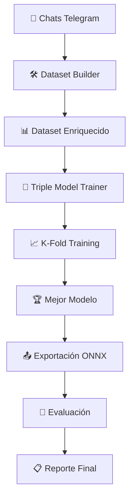

# 🚀 Pipeline de Detección de Hilos en Conversaciones

Un sistema avanzado para detectar relaciones de respuesta implícitas entre mensajes usando **tres modelos especializados** entrenados con datos enriquecidos de chats de Telegram.

---

## 📊 **Arquitectura del Sistema**

### 🎯 **Tres Modelos Especializados**

#### 1. **Bi-Encoder A** 🏎️
- **Modelo**: `paraphrase-multilingual-mpnet-base-v2`
- **Fortaleza**: Excelente para comprensión multilingüe y semántica profunda
- **Uso**: Genera embeddings de alta calidad para comparación semántica

#### 2. **Bi-Encoder B** ⚡
- **Modelo**: `sentence-transformers/all-MiniLM-L12-v2`
- **Fortaleza**: Rápido y eficiente, ideal para procesamiento en tiempo real
- **Uso**: Balance perfecto entre velocidad y precisión

#### 3. **Cross-Encoder** 🎯
- **Modelo**: `cross-encoder/ms-marco-MiniLM-L-12-v2`
- **Fortaleza**: Máxima precisión en detección de relaciones contextuales
- **Uso**: Análisis profundo de pares de mensajes para casos difíciles

### 🤔 **¿Por qué Tres Modelos?**

| Modelo | Velocidad | Precisión | Caso de Uso |
|--------|-----------|-----------|-------------|
| Bi-Encoder A | 🟡 Media | 🟢 Alta | Búsqueda semántica multilingüe |
| Bi-Encoder B | 🟢 Alta | 🟡 Media | Filtrado rápido y eficiente |
| Cross-Encoder | 🔴 Baja | 🟢 Máxima | Decisión final en casos ambiguos |

---

## 🏗️ **Pipeline Completo**

### 🔄 **Flujo de Procesamiento**



---

## 📁 **Estructura del Proyecto**

```
threads_analysis/
├── knowledge_graph.py              # 🔍 Construcción del grafo + heurísticas reply implícito
├── models/
│   ├── dataset_builder.py          # 🏗️ Construye dataset con hard negatives
│   ├── triple_model_trainer.py     # 🤖 Entrena los 3 modelos
│   ├── onnx_export.py              # 📤 Exporta modelos a ONNX
│   ├── evaluation.py               # 🧪 Evalúa vs heurísticas
│   ├── pipeline_runner.py          # 🚀 Ejecuta TODO el pipeline
│   ├── embeddings_cache/
│   │   └── sentence-transformers__all-mpnet-base-v2/
│   │       ├── 0_meta.json         # 📋 Metadatos del chat 0
│   │       ├── 0.npy               # 💾 Embeddings del chat 0
│   │       ├── 1_meta.json         # 📋 Metadatos del chat 1
│   │       ├── 1.npy               # 💾 Embeddings del chat 1
│   │       ├── 2_meta.json         # 📋 Metadatos del chat 2
│   │       ├── 2.npy               # 💾 Embeddings del chat 2
│   │       └── ...                 # 📊 Más chats numerados
│   └── output/                     # 📦 Salidas del pipeline
│       ├── pairs_with_hard_neg.jsonl
│       ├── pairs_with_hard_neg.jsonl.meta.json  # 📋 Metadatos del dataset
│       ├── training_summary.json   # 📊 Resumen entrenamiento
│       ├── fold_0/                 # 🎯 Modelos del fold 0
│       │   ├── bi_encoder_A_fold0.pth
│       │   ├── bi_encoder_B_fold0.pth
│       │   └── cross_encoder_fold0.pth
│       ├── fold_1/                 # 🎯 Modelos del fold 1
│       │   ├── bi_encoder_A_fold1.pth
│       │   └── ...
│       ├── bi_encoder_A.onnx       # 📤 Modelo exportado
│       ├── bi_encoder_B.onnx       # 📤 Modelo exportado
│       ├── cross_encoder.onnx      # 📤 Modelo exportado
│       └── evaluation_report.json  # 📈 Resultados evaluación
└── threads_analysis_results/       # 📥 Entrada de datos
    └── train_chats/
        ├── chat_1.json             # 💬 Chat de entrenamiento 1
        ├── chat_2.json             # 💬 Chat de entrenamiento 2
        └── ...                     # 💬 Más chats
```

## 🎯 **Cómo Ejecutar**

### 🚀 **Ejecutar Todo el Pipeline**
```bash
python threads_analysis/models/pipeline_runner.py
```

### ⚙️ **Parámetros Opcionales**
```bash
python threads_analysis/models/pipeline_runner.py \
    --train-chats "ruta/chats" \
    --output-dir "ruta/salida" \
    --epochs 4 \
    --batch-size 32 \
    --folds 5
```

---

## 🏗️ **Construcción del Dataset**

### 📊 **Proceso de Enriquecimiento**

#### 🔍 **Detección de Pares Reales**
```python
# Para cada mensaje con reply_id válido
par_positivo = {
    'a': mensaje_padre,      # El mensaje referenciado
    'b': mensaje_actual,     # La respuesta
    'label': 1,              # ✅ Es una respuesta real
    'time_delta_min': 0.083, # 5 segundos en minutos
    'same_author': 0         # ¿Mismo remitente?
}
```

#### 🎯 **Generación de Hard Negatives**
```python
# Busca mensajes SEMÁNTICAMENTE similares pero NO relacionados
hard_negative = {
    'a': mensaje_similar,    # Parecido semántico al mensaje real
    'b': mensaje_actual,
    'label': 0,              # ❌ NO es respuesta
    'hard_negative': True    # ⚠️ Ejemplo difícil
}
```

#### 📈 **Características Extraídas**
- **`tfidf_jaccard`**: Similitud de temas usando TF-IDF
- **`seq_ratio`**: Similitud textual directa
- **`emoji_diff`**: Diferencia en uso de emojis
- **`both_have_url`**: Ambos contienen enlaces
- **`both_all_caps`**: Ambos usan mayúsculas
- **`time_delta_min`**: Distancia temporal

---

## 🤖 **Entrenamiento de Modelos**

### 🎪 **K-Fold Cross Validation**
```python
# Entrenamiento robusto con validación cruzada
for fold in range(5):  # 5 folds
    # 1. Fine-tune bi-encoders con MultipleNegativesRankingLoss
    # 2. Entrenar MLP classifier sobre embeddings
    # 3. Entrenar cross-encoder como clasificador binario
    # 4. Validar y guardar métricas
```

### 🏆 **Selección del Mejor Modelo**
- **Métrica principal**: F1-Score en validación
- **Selección automática**: Mejor fold por modelo
- **Backup**: Todos los folds guardados

---

## 📤 **Exportación ONNX**

### 🤔 **¿Qué es ONNX?**
**ONNX** (Open Neural Network Exchange) es un formato estándar para modelos de machine learning que permite:

### 🎯 **Ventajas**
- **🚀 Inferencia más rápida**: Optimizado para producción
- **🔧 Interoperabilidad**: Funciona en múltiples frameworks
- **📱 Multiplataforma**: CPU, GPU, móviles, edge devices
- **⚡ Sin dependencias**: No requiere PyTorch/TensorFlow en producción

### 🔄 **Proceso de Exportación**
```python
# Convierte modelo PyTorch a ONNX
torch.onnx.export(
    model,                      # Modelo entrenado
    dummy_input,               # Input de ejemplo
    "modelo.onnx",             # Archivo de salida
    opset_version=11,          # Versión de operadores
    input_names=['input'],     # Nombres de inputs
    output_names=['output']    # Nombres de outputs
)
```

### 🎯 **¿Por qué Exportar a ONNX?**
1. **🚀 Despliegue en producción** sin dependencias pesadas
2. **📱 Ejecución en dispositivos** con recursos limitados
3. **🔧 Compatibilidad** con múltiples lenguajes (C++, Java, C#)
4. **⚡ Optimizaciones** específicas por hardware

---

## 🧪 **Evaluación del Sistema**

### 📊 **Métricas de Evaluación**
- **AUC**: Área bajo la curva ROC
- **Precisión**: Exactitud en predicciones positivas
- **Recall**: Capacidad de detectar todos los positivos
- **F1-Score**: Balance entre precisión y recall

### 🔍 **Comparativa Completa**
El sistema evalúa **4 enfoques**:

1. **🔍 Heurísticas Tradicionales**: Reglas basadas en knowledge graph
2. **🏎️ Bi-Encoder A**: MPNet multilingüe para semántica profunda
3. **⚡ Bi-Encoder B**: MiniLM para velocidad y eficiencia
4. **🎯 Cross-Encoder**: Máxima precisión contextual

### 📈 **Reporte de Evaluación**
```json
{
  "heuristics": {"auc": 0.75, "f1": 0.68},
  "bi_encoder_A": {"auc": 0.89, "f1": 0.82},
  "bi_encoder_B": {"auc": 0.87, "f1": 0.80},
  "cross_encoder": {"auc": 0.92, "f1": 0.85}
}
```

---

## 📦 **Salidas del Pipeline**

### ✅ **Archivos Generados**
- **`pairs_with_hard_neg.jsonl`**: Dataset completo enriquecido
- **`training_summary.json`**: Resumen de entrenamiento y mejores folds
- **`fold_*/model.pth`**: Modelos entrenados por cada fold
- **`*.onnx`**: Modelos exportados para producción
- **`evaluation_report.json`**: Comparativa completa de rendimiento

### 🎯 **Modelos ONNX Exportados**
1. **`bi_encoder_A.onnx`** - MPNet multilingüe optimizado
2. **`bi_encoder_B.onnx`** - MiniLM rápido y eficiente
3. **`cross_encoder.onnx`** - Máxima precisión contextual

---

## ⚙️ **Requisitos del Sistema**

### 📦 **Dependencias**
```bash
pip install sentence-transformers torch scikit-learn numpy scipy tqdm pandas rich onnx onnxruntime
python -m spacy download es_core_news_md
```

### 📁 **Estructura de Entrada**
Coloca tus chats en:
```
threads_analysis_results/train_chats/*.json
```

Ejemplo de estructura:
```json
{
  "metadata": {"chat_id": "grupo_1"},
  "messages": [
    {
      "id": 123,
      "text": "¿Alguien quiere pizza?",
      "reply_id": null,
      "date": "2023-10-01T10:00:00",
      "sender_id": "user1"
    }
  ]
}
```

---

## 🎯 **Casos de Uso**

### 💬 **Detección de Replies Implícitos**
```
Usuario A: "¿Alguien quiere pizza?"          🎯
Usuario B: "¡Yo sí! Con pepperoni"           ✅ Respuesta detectada
Usuario C: "Acabo de almorzar"               ✅ Respuesta detectada  
Usuario D: "Hoy hace buen día"               ❌ No relacionado
```

### 🔍 **Aplicaciones**
- **📊 Análisis de conversaciones**: Entender flujos de discusión
- **🤖 Chatbots**: Mejorar comprensión contextual
- **📈 Business Intelligence**: Analizar patrones de comunicación
- **🔍 Moderación**: Detectar hilos de conversación problemáticos

---

## 🚀 **Próximos Pasos**

1. **🎯 Despliegue en Producción**: Usar modelos ONNX exportados
2. **📱 API de Inferencia**: Servicio para detección en tiempo real
3. **🔧 Fine-tuning Continuo**: Mejora con nuevos datos
4. **🌐 Multiplataforma**: Ejecución en edge devices

---

## 💡 **¿Por qué este Enfoque?**

### 🏆 **Ventajas Clave**
- **🎯 Precisión Máxima**: Combinación de 3 modelos especializados
- **🚀 Velocidad de Inferencia**: ONNX optimizado para producción
- **🔍 Robustez**: Hard negatives + K-fold validation
- **📊 Evaluación Completa**: Comparativa contra heurísticas existentes

### ⚡ **Ready for Production**
Los modelos ONNX exportados están listos para:
- **🎯 Despliegue inmediato** en entornos productivos
- **🚀 Inferencia rápida** sin dependencias de PyTorch
- **📱 Ejecución eficiente** en múltiples plataformas

---

**¿Listo para detectar relaciones en tus conversaciones? ¡Ejecuta el pipeline y descubre insights ocultos! ...Solo si tienes 2 días completos uno para hacer embeddings y otro para entrenar (sin gpu puede que más) y al menos estar dispuesto y con condiciones para bajar > 1.5 GB de espacio total que ocupan los modelos (sin contar los embbedings o el dataset que puede llegar a pesar mucho, con los datos usados peso ~1.4 GB) En fin, que divertidoooo... no me dolió en los datos móviles ni anda jaja** 🎉